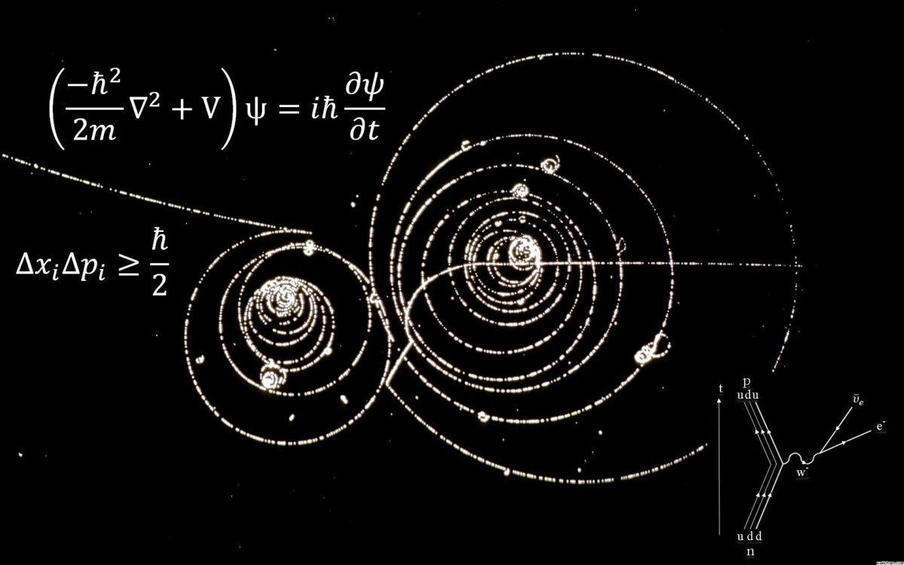

# homework
### 21180410窦富源


#### Link to my url 

​	这是一个链接 [baidu](https://www.baidu.com)
#### Link to page2

​	[page2.md](./page2.md) 

####  quantum mechanics



#### img from web


#### some code

``` js
var foo = function (bar) {
  return bar++;
};

console.log(foo(5));
```


####  blockquote

```
> 最外层
> > 第一层嵌套
> > > 第二层嵌套
```


####  bulleted list

```
* 第一项
* 第二项
* 第三项
```

####  number list

```
1. 第一项
2. 第二项
3. 第三项
```

####  table

| 表头 | 表头 |      |
| ---- | ---- | ---- |
| 1    | 2    | 3    |
| 4    | 5    | 6    |


#### others

**加粗**

*斜体*

~~删除线~~

---
